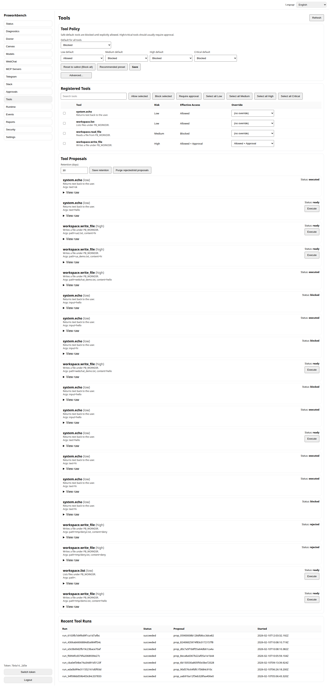
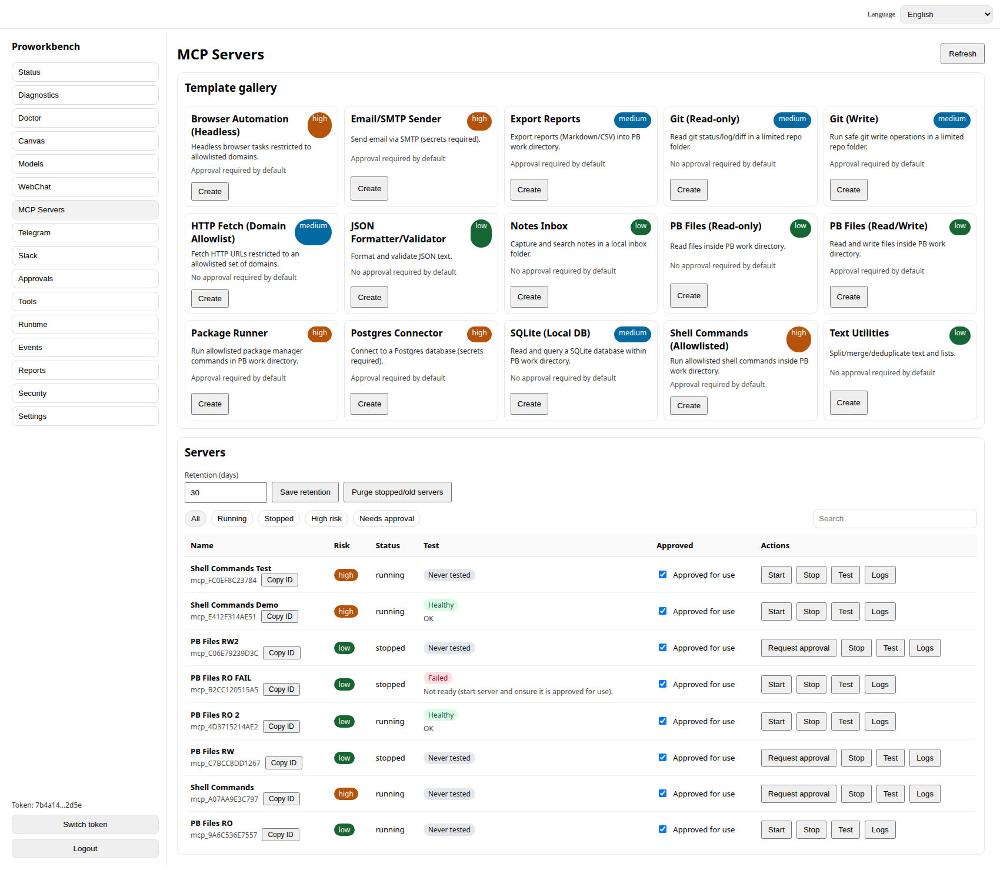
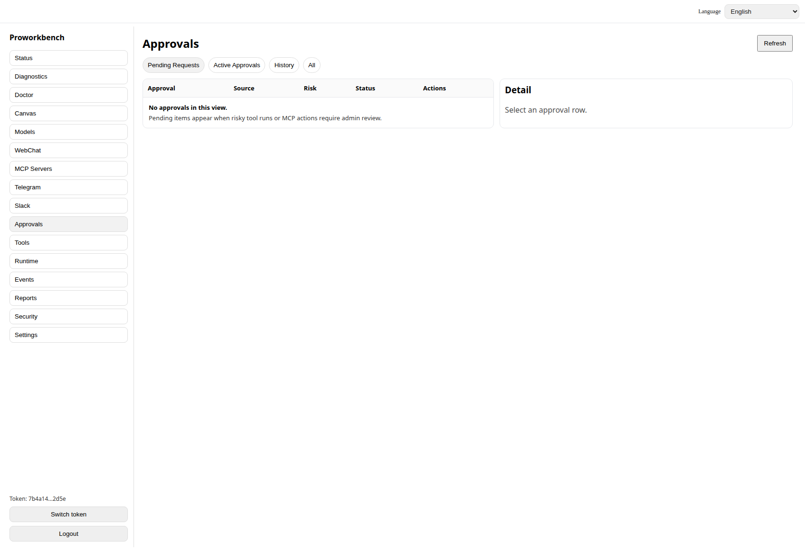
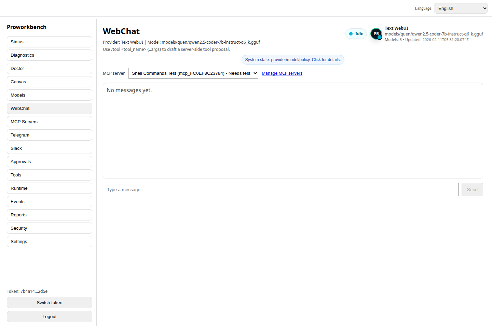

# Proworkbench (Preview v0.1)

Local-first AI assistant with approvals, presets, and Doctor self-heal.

[](https://github.com/jamiegrl100/proworkbench/actions/workflows/ci.yml)
[](./LICENSE)
[](https://github.com/jamiegrl100/proworkbench/releases)
[](#)

## Table of contents
- Screenshots
- Quick Start (10 minutes)
- Safety model
- FAQ
- Docs
- Links

**Why it’s different**
- Local-first + safe-by-default: tools are blocked until explicitly allowed, with approvals for risky actions.
- WebChat-only execution: tools and MCP run only from the Web Admin UI (never from Telegram/Slack).
- Doctor “Fix my setup”: one place to detect issues and guide non-tech users to green.
- Canvas command center: persistent cards for tool results, MCP actions, Doctor reports, and notes.
- Persistent memory: daily scratch/summary with governed durable finalize flow.
- Watchtower: idle-only proactive checks that create proposals but never auto-invoke.
- Helper swarm (power user): optional 0-5 helper assistants with presets and budget mode, still LLM-only.

## OpenClaw users
- Website comparison article: https://proworkbench.com/openclaw-alternative/
- Repo doc version: `docs/openclaw-alternative.md`

Proworkbench’s stance is governed autonomy: explicit invoke, approvals-first for risk, and local-first operation.

**Channel policy (non-negotiable)**
- WebChat (Web Admin UI): may run tools and MCP (subject to policy + approvals).
- Telegram/Slack: chat/inbox/notifications only with allowlist controls. **No execution**, permanently blocked server-side.

**Remote access support policy**
- Supported: VPN/tailnet/private LAN you control.
- Not supported: exposing PB directly to the public internet.

## Screenshots
Current preview screenshots:
- `assets/screenshots/polish-tools-page.png`
- `assets/screenshots/polish-mcp-page.png`
- `assets/screenshots/polish-approvals-empty-state.png`
- `assets/screenshots/webchat-system-chip-collapsed.png`






## Quick Start (10 minutes)

### 1) Start Proworkbench
```bash
cd /home/jamiegrl100/Apps/proworkbench
npm install
npm run dev
```

- PB server: `http://127.0.0.1:8787`
- PB UI dev server: `http://127.0.0.1:5173` (pinned, strict port)

### 2) Start Text Generation WebUI (manual)
PB does **not** start/manage Text WebUI. You run it manually.

Example (Linux):
```bash
cd ~/Apps/text-generation-webui
./start_linux.sh --api --api-port 5000 --listen-host 127.0.0.1
```

Text WebUI OpenAI-compatible API:
- `http://127.0.0.1:5000/v1/models`
- `http://127.0.0.1:5000/v1/chat/completions`

### 3) Load a model in Text WebUI
If `/v1/models` is empty, open the Text WebUI UI and load a model, then come back and refresh in PB.

Known-good model:
- `models/quen/qwen2.5-coder-7b-instruct-q6_k.gguf`

### 4) Open PB and run Doctor
Go to **Doctor** and click:
- **Fix my setup** (recommended) or **Run checks only**

Doctor will tell you what PB fixed and what you need to do (for example: “Start Text WebUI” or “Load a model”).

## Safety Model (short)
- Admin auth is header-token only: `Authorization: Bearer <token>` (stored in `localStorage.pb_admin_token`).
- Tools and MCP are gated by policy and a unified approvals queue.
- Secrets are not echoed back and are masked in reports where possible.

## FAQ

**Text WebUI is running but PB says no models**
- Common cause: model not loaded yet. Open Text WebUI, load a model, then refresh PB.

**Why doesn’t Telegram/Slack run tools?**
- For security: social channels are chat-only. Execution is WebChat-only by design.

**I see 401 Unauthorized**
- Your token is missing/invalid. Paste a valid token in the login screen.

## Docs
- Start here: `docs/README.md`
- Getting started: `docs/getting-started.md`
- Ship gate checklist: `docs/smoke-test.md`
- Security: `docs/security.md`
- Security model deep dive: `docs/security-model-block-by-default.md`
- Doctor deep dive: `docs/doctor-accident-prevention.md`
- Memory model: `docs/MEMORY.md`
- Watchtower: `docs/watchtower.md`
- Architecture: `docs/architecture.md`
- Roadmap: `docs/roadmap.md`

## Links
- Releases: https://github.com/jamiegrl100/proworkbench/releases
- Discussions: https://github.com/jamiegrl100/proworkbench/discussions
