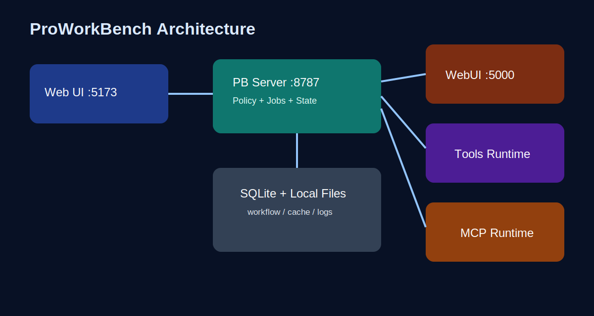
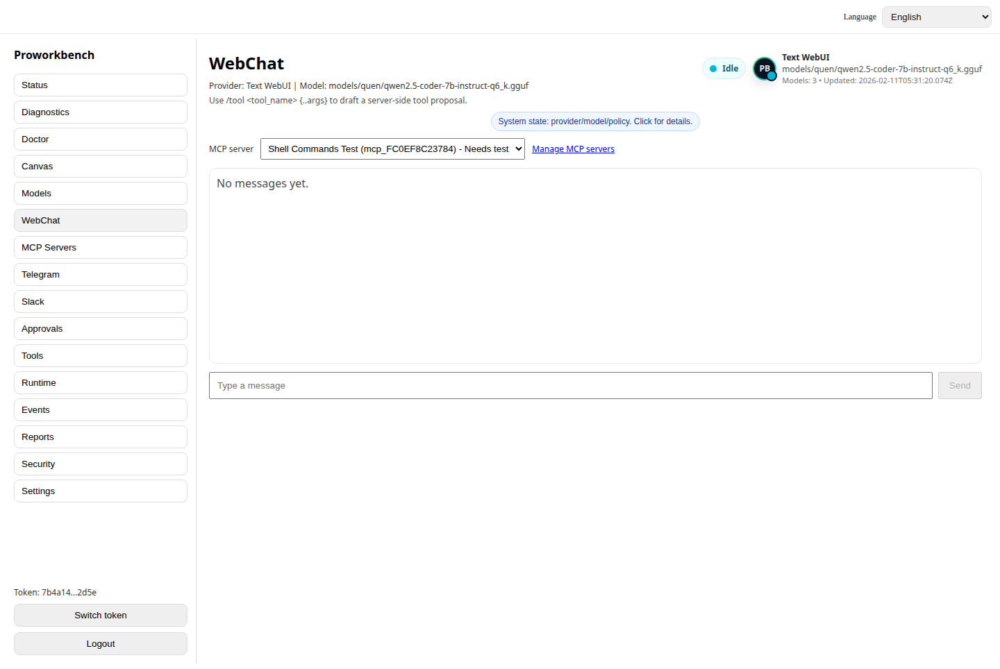
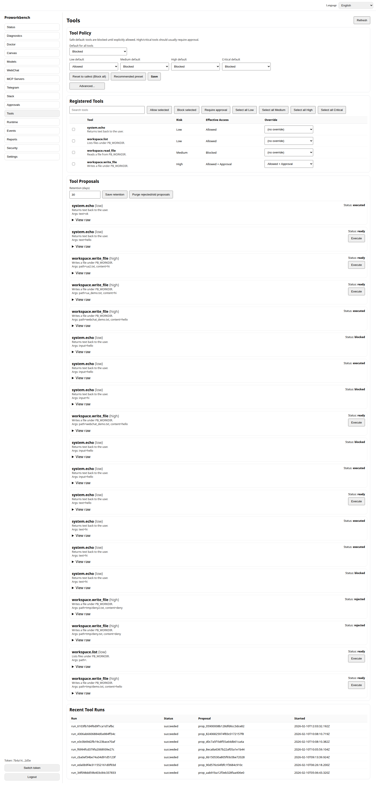
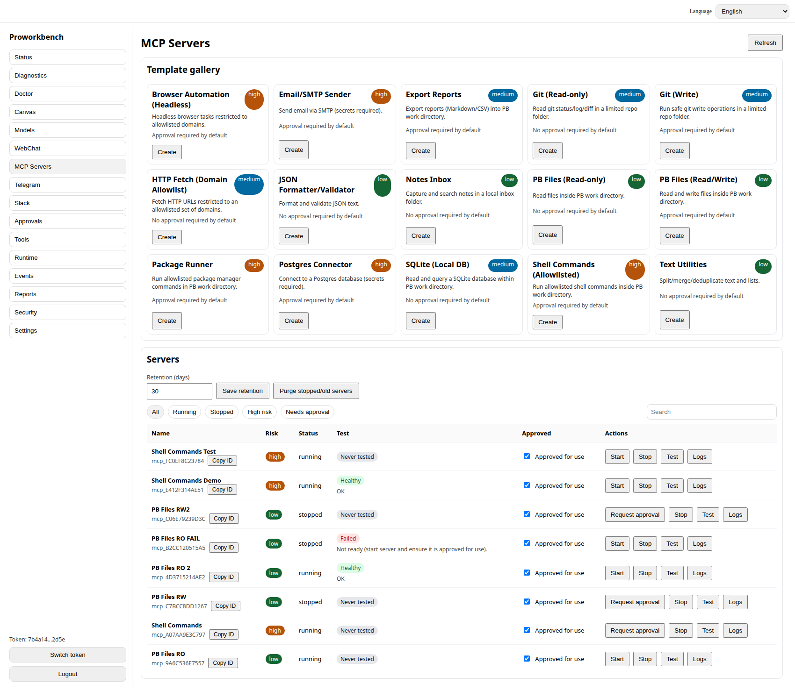

# ProWorkBench

Local-first AI workbench for operators who want execution control.

[](https://github.com/jamiegrl100/proworkbench/actions/workflows/ci.yml)
[](./LICENSE)
[](https://github.com/jamiegrl100/proworkbench/releases)

## What It Is

ProWorkBench is a local orchestration shell for:
- `WebChat` (operator control plane)
- `Tools` (filesystem/process operations)
- `MCP` (browser/media automation)
- `Doctor` checks and remediation guidance

Execution is operator-mediated: no hidden background tool execution, no silent approvals.

## What It Is Not

- Not a hosted SaaS.
- Not a no-ops “auto-pilot” agent.
- Not a replacement for your model server. You bring your own OpenAI-compatible backend (commonly Text Generation WebUI).

## Quickstart (3 Steps)

### Linux/macOS
```bash
cd /home/jamiegrl100/Apps/proworkbench
npm install
npm run dev
```

### Windows (PowerShell)
```powershell
cd C:\path\to\proworkbench
npm install
npm run dev
```

Then:
1. Open `http://127.0.0.1:5173`
2. Open **Doctor** and run checks
3. Connect your model server (`http://127.0.0.1:5000`) and run your first preset

## Architecture



```text
Web UI (5173) -> PB Server (8787) -> Model API (OpenAI-compatible)
                            |-> Tools runtime
                            |-> MCP runtime
                            |-> SQLite + local state
```

## Verified Feature Set

- Local-first state and logs
- Approvals queue and policy hooks
- Doctor diagnostics and guided remediation
- MCP template/build/test/install flow
- WebChat route control (direct vs browse flow)
- Workflow triage states (`new`, `needs_review`, `done`, `ignored`)

## Screenshots

- 
- 
- 
- 

## FAQ

### Does ProWorkBench ship a model?
No. Connect your own OpenAI-compatible server.

### Does it require internet?
Core runtime is local-first. Internet depends on the integrations/tools you enable.

### Where is data stored?
Local app data + SQLite in your configured data directory.

### Can social channels execute tools?
By policy design, channel behavior can be restricted. Keep execution on WebChat for operator visibility.

## Docs

- [Docs Index](./docs/README.md)
- [Install](./docs/INSTALL.md)
- [Quickstart](./docs/QUICKSTART.md)
- [Doctor](./docs/DOCTOR.md)
- [MCP Presets](./docs/MCP_PRESETS.md)
- [Security](./docs/SECURITY.md)
- [Troubleshooting](./docs/TROUBLESHOOTING.md)
- [Development](./docs/DEVELOPMENT.md)
- [Changelog](./docs/CHANGELOG.md)

## Roadmap (near-term)

- Installer packaging (Windows/macOS/Linux)
- Projects tab hardening
- Submission Assistant stabilization
- Signed release artifacts

If a roadmap item is not implemented yet, track it as a GitHub issue before shipping claims.

## Links

- Website: https://proworkbench.com
- GitHub Issues: https://github.com/jamiegrl100/proworkbench/issues
- Discussions: https://github.com/jamiegrl100/proworkbench/discussions
- Releases: https://github.com/jamiegrl100/proworkbench/releases
