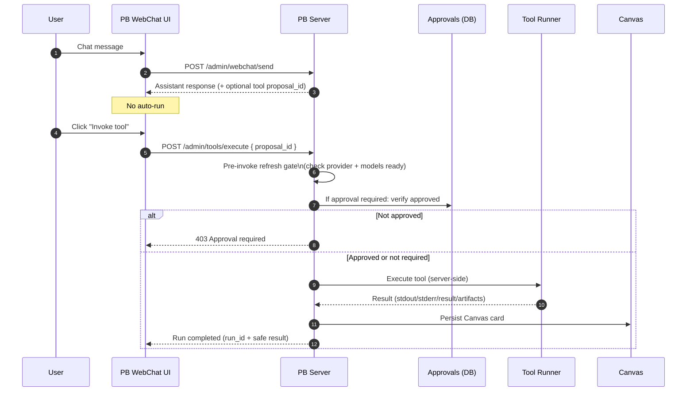
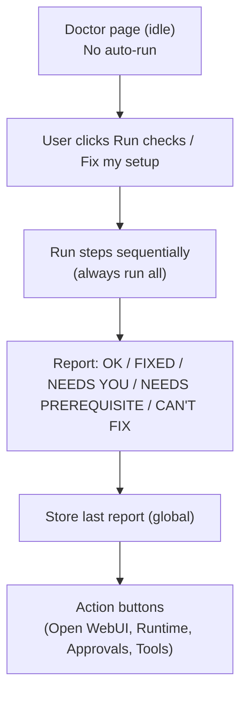
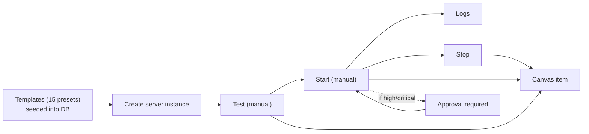

# Architecture (Preview v0.1)

This page shows how the system fits together and where the security boundaries are.

## System architecture

```mermaid
flowchart LR
  subgraph Browser["Browser (Local)"]
    UI["PB UI (Vite/React)\n127.0.0.1:5173"]
  end

  subgraph PBStack["Proworkbench Server (Local)\nExpress + SQLite\n127.0.0.1:8787"]
    PBAPI["PB API router"]
    Auth["Admin auth\nAuthorization: Bearer token"]
    DB["SQLite\n(app state, approvals, MCP servers,\ncanvas, events)"]
    ToolRunner["Tool runner (server-side only)"]
    Approvals["Unified approvals queue\n(tool + MCP actions)"]
    Canvas["Canvas storage\n(persistent cards)"]
    MCP["MCP subsystem\n(templates + servers)"]
    Channels["Channels\nTelegram / Slack\n(chat-only)"]
  end

  subgraph WebUI["Text Generation WebUI (Local)\nOpenAI-compatible API\n127.0.0.1:5000"]
    Models["/v1/models"]
    Chat["/v1/chat/completions"]
  end

  UI -->|admin API (proxied)| PBAPI
  PBAPI --> Auth
  PBAPI --> DB
  PBAPI -->|probe/models/chat| WebUI

  PBAPI --> Approvals
  PBAPI --> ToolRunner
  ToolRunner --> Canvas
  MCP --> Canvas
  PBAPI --> MCP
  PBAPI --> Channels

  %% Security boundaries
  Channels -. hard blocked execution .-> ToolRunner
  Channels -. hard blocked execution .-> MCP
```

**Security boundaries**
- Tools and MCP run **only** on the PB server.
- Social channels (Telegram/Slack) are **chat-only** and are hard blocked from execution paths.

## Tool execution flow



## Doctor flow



## MCP lifecycle (high level)


