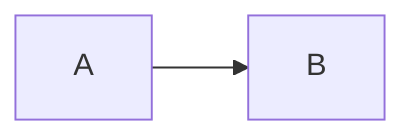

# Docs Style Guide

## Tone
- Plain English.
- Short steps.
- Avoid jargon; if needed, define it once.

## Structure
Each page should have:
1. A one-sentence purpose.
2. “What you’ll see”.
3. “How to verify it works”.
4. An optional “Advanced” section (last).

## Callouts
Use GitHub callouts:

> [!NOTE]
> Notes are informational.

> [!WARNING]
> Warnings are for safety and irreversible actions.

## Diagrams
Prefer Mermaid:

## Accuracy rules
- Do not claim a feature exists unless it is shipped in the repo.
- If something is planned, label it **Planned**.
- If behavior is security sensitive (execution, approvals, auth), be explicit.

