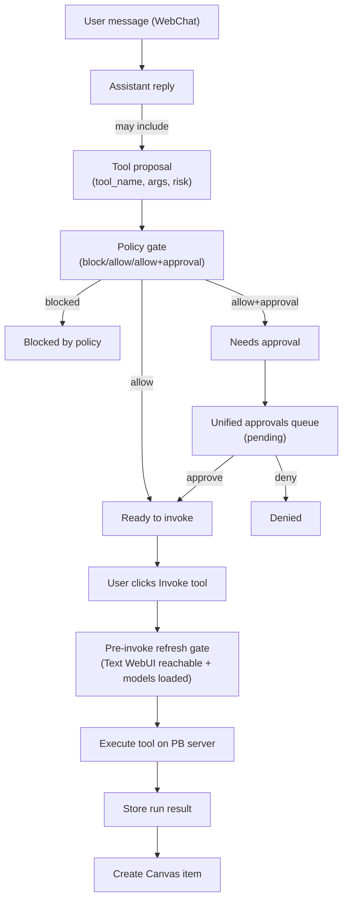
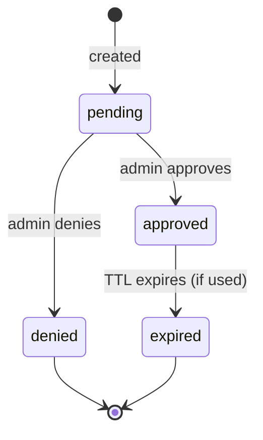

# Tools and Approvals

PB is safe-by-default: tools do not execute until explicitly allowed, and risky actions require approval.

## What you’ll see
- A **Tools** page with:
  - tool policy (defaults + per-risk settings + per-tool overrides)
  - tool proposals and runs
- An **Approvals** page with one queue for:
  - tool runs
  - MCP actions (start/test/edit) that require approval
- In **WebChat**:
  - tool proposals show an “Invoke tool” button
  - approvals-required proposals show “Needs approval”

## Core rules

> [!WARNING]
> Tools and MCP execution are WebChat-only. Telegram/Slack are chat-only and cannot execute anything.

**No auto-run**
- The model may propose.
- A human must click **Invoke tool** to run it.

**Helper swarm constraints**
- Helper assistants are LLM-only.
- Helpers cannot execute tools or MCP actions (server-side 403).

## Tool execution flow (Mermaid)

## Approvals lifecycle (Mermaid)

## How to verify it works
1. Open **Tools** and confirm the default stance is safe (blocked unless allowed).
2. In **WebChat**, create a proposal and confirm:
   - blocked tools show “Blocked by policy”
   - approval-required tools show “Needs approval” and link to **Approvals**
3. Approve a pending item, then return to WebChat and click **Invoke tool**.
4. Confirm a Canvas item was created for the run result.
5. In **Tools**, use retention controls to purge only rejected/old proposals and verify pending approvals are skipped.

## Advanced (for debugging)
If a tool cannot be invoked, check:
- tool policy effective access (Tools page)
- approval status (Approvals page)
- provider readiness (Runtime page, Text WebUI models loaded)
